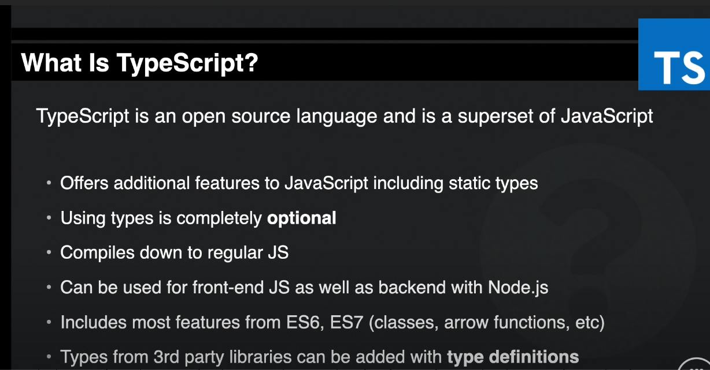
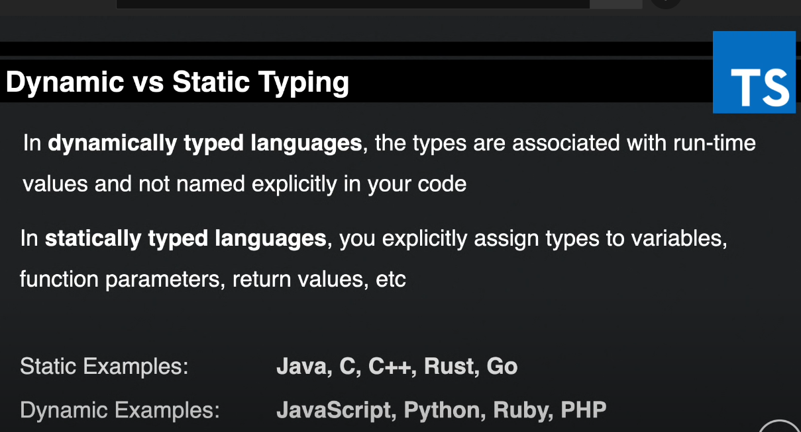
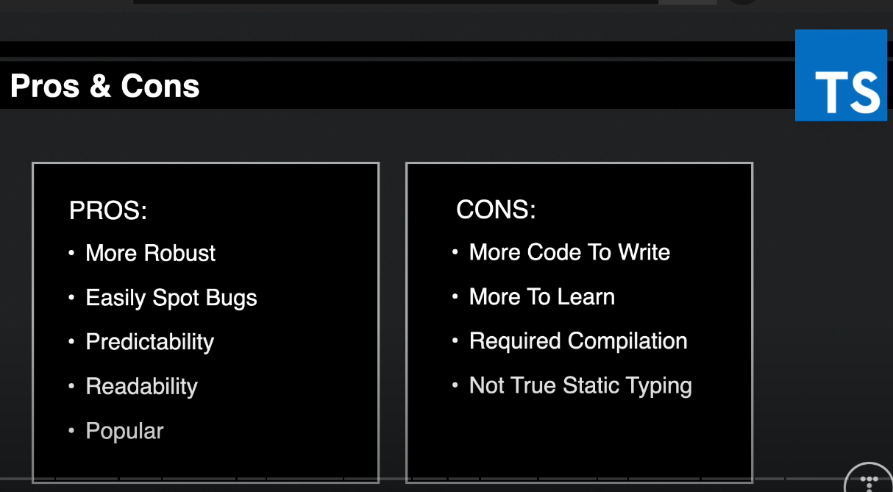

# watch-crash-typescript

_November 2021_

> 🔨 From Traversy Media: [TypeScript Crash Course 2021](https://www.youtube.com/watch?v=BCg4U1FzODs).

---

## Whats is Typescript








## Exemple of error in VSCode


## How to compile?

`tsc index`

`tsc -- watch index`

`tsc`

`tsc -- watch`

## How to create a _tsconfig.json_?

`tsc --init`

Exemple:

```json
   "outDir": "./dist",
   "rootDir": "./src",
```

## Typescript case studies and exemples

_./src/index.ts_

- Basic Types
- Tuple
- Tuple array
- Union
- Enum
- Objects / Custom types
- Functions
- Void
- Interfaces
- Interfaces with functions
- Interfaces with classes
- Interfaces with classes

```ts
/* Basic Types */
let id: number = 5;
let company: string = "Raigyo-dev";
let isPublished: boolean = true;
let fruits: string[] = ["Apple", "Orange", "Banana"];
let fruits2: Array<string> = ["Apple", "Orange", "Banana"];
let arrayMixed: Array<string | number> = ["Apple", 2, "Orange", 3, 4, "Banana"];
let arrayAny: any = [1, 2, "Banaba", true];

// fruits.push("Kiwi"); // OK
// fruits.push(2); // KO

/* Tuple = array with a fixed number of elements whose types are known, but need not be the same*/

let person: [number, string, boolean] = [1, "Vincent", true];

/* Tuple array */
let employee: [number, string][];

employee = [
  [1, "Brad"],
  [2, "John"],
  [3, "Vincent"],
];

/* Union */
let pid: string | number;
pid = "22";

/* Enum */
enum Direction1 {
  Up = 1,
  Down,
  Left,
  Right,
}

// console.log(Direction1.Up);
// `node ./dist/index.js` => Output: 1

enum Direction2 {
  Up = "Up",
  Down = "Down",
  Left = "Left",
  Right = "Right",
}

/* Objects */
const user: {
  id: number;
  name: string;
} = { id: 1, name: "John" };

// or

type User = {
  id: number;
  name: string;
};

const user2: User = { id: 1, name: "John" };

/* Type assertion */

/* Sometimes you’ll end up in a situation where you’ll know more about a value than TypeScript does.
 Usually, this will happen when you know the type of some entity could be more specific than its
 current type. */
let cid: any = 1;
let customerId = <number>cid;
let customerId2 = cid as number;

/* Functions */
function addNum(x: number, y: number) {
  return x + y;
}

export {};
```

## Useful links

- [cannot redeclare block scoped variable (typescript)](https://stackoverflow.com/questions/35758584/cannot-redeclare-block-scoped-variable-typescript)
